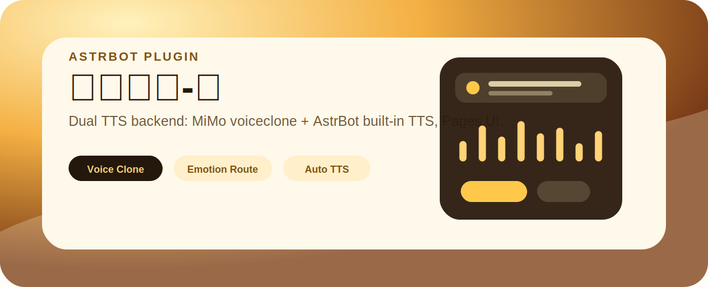

<p align="center">
  
</p>

<h1 align="center">MiMo TTS Voice Clone for AstrBot</h1>

<p align="center">
  基于 MiMo 官方 <code>mimo-v2.5-tts-voiceclone</code> 的 AstrBot TTS 音色克隆插件。<br />
  支持 Pages 可视化管理、多音色切换、情绪路由、自动语音化、试听诊断与输出清理。
</p>

<p align="center">
  <a href="https://github.com/Justice-ocr/astrbot_plugin_mimo_tts_clone">GitHub 仓库</a>
  ·
  <a href="https://mimo.mi.com/docs/zh-CN/quick-start/usage-guide/multimodal-understanding/speech-synthesis-v2.5">MiMo 官方文档</a>
  ·
  <a href="#免责声明">免责声明</a>
</p>

<p align="center">
  
</p>

## 适合谁

- 想在 AstrBot 里接入 MiMo 官方 voiceclone TTS 的用户。
- 想用 Pages 页面管理多个授权音色、默认音色和试听流程的机器人管理员。
- 想让 `/tts` 命令或普通 LLM 回复按概率转为语音的群聊/私聊场景。
- 想给其他插件复用统一 TTS 服务能力的插件开发者。

## 功能概览

| 模块 | 能力 |
| --- | --- |
| 官方 API 接入 | 支持 MiMo v2.5 voiceclone，OpenAI-compatible 调用方式 |
| 音色库 | 上传 `mp3` / `wav` 授权样本，本地保存音色元数据 |
| 多音色路由 | 支持全局、群、用户、情绪四类默认音色 |
| 情绪控制 | 支持 `happy`、`sad`、`angry`、`neutral`，可自动轻量识别 |
| 发送前 AI 导演 | 可指定 AstrBot AI 服务商，为每段文本生成隐藏风格指令，并可优化只用于音频的朗读文本 |
| 发送策略 | 支持只发音频、文字+音频、只发文字 |
| 自动语音化 | 普通 LLM 回复可按概率转语音，支持群聊/私聊黑白名单和管理员绕过，默认关闭 |
| 试听诊断 | Pages 内一键诊断 Key、模型、音色和网络链路 |
| 输出清理 | 按保留天数和最大文件数自动清理生成音频 |
| 插件复用 | 暴露 `synthesize_text()`、`list_available_voices()`、`resolve_voice_id()` 方法 |

## 界面导览

插件 Pages 被设计成一条清晰的工作流：


页面重点区域：

- `连接配置`：填写 MiMo API Key、Base URL、模型、并发和文本长度限制。
- `发送策略`：切换只发音频、文字+音频、只发文字；配置自动语音化概率。
- `发送前 AI 导演`：根据文本、情绪和音色生成 MiMo 风格控制指令；可剔除无意义口头填充并加入自然停顿，只影响音频，不改变最终回复文本。
- `情绪与分段`：控制情绪路由和长文本分段。
- `音色库`：上传授权音频、设置风格标签和默认音色。
- `试听工作台`：选择音色、情绪和临时风格指令，快速试听。

## 安装

1. 将本仓库放入 AstrBot 插件目录。

```bash
git clone https://github.com/Justice-ocr/astrbot_plugin_mimo_tts_clone.git
```

2. 安装依赖。

```bash
pip install -r requirements.txt
```

3. 在 AstrBot 插件管理中启用本插件。

4. 打开插件 Pages，填写 MiMo API Key 并点击 `保存全部配置`。

5. 上传已授权的 `mp3` / `wav` 音色样本。

6. 点击 `一键诊断` 或在试听工作台测试音色。

## 基础命令

```text
/tts 文本
/tts -v 音色名 文本
/tts -e happy 文本
/tts -v 音色名 -e sad -c "轻声、慢速" 文本
/tts音色列表
/tts设置音色 音色名
/tts默认音色 音色名
/tts群默认音色 音色名
/tts情绪音色 happy 音色名
/tts状态
```

说明：

- `/tts`、`/朗读`、`/语音` 都可触发命令朗读。
- `-v` 用于指定音色名或音色 ID。
- `-e` 支持 `happy`、`sad`、`angry`、`neutral`。
- `-c` 可临时追加风格指令，例如“更轻、更近、像深夜电台”。
- 管理类命令依赖 `admin_users` 配置。

## 推荐配置

| 配置项 | 推荐值 | 说明 |
| --- | --- | --- |
| `reply_mode` | `audio_only` | 命令式 TTS 通常只发语音更干净 |
| `auto_tts_enabled` | `false` | 普通回复自动语音化建议按群逐步开启 |
| `auto_tts_probability` | `0.1` - `0.3` | 避免群聊中过度刷屏 |
| `max_voice_file_mb` | `10` | 越大请求体越大，速度也可能变慢 |
| `segment_enabled` | `true` | 长文本更稳定 |
| `output_retention_days` | `7` | 防止长期运行占用磁盘 |
| `output_max_files` | `100` | 小型机器人通常足够 |

## MiMo 调用约束

插件按 MiMo v2.5 TTS 官方文档的 voiceclone 方式调用：

- 模型默认使用 `mimo-v2.5-tts-voiceclone`。
- 待朗读文本放在 `messages[].role = assistant` 的 `content` 中。
- 风格、语气、情绪等自然语言控制放在 `role = user` 的消息中。
- 参考音频通过 `audio.voice = data:{MIME_TYPE};base64,{BASE64_AUDIO}` 传入。
- 参考音频仅支持 `mp3` / `wav`，默认限制为 10MB。
- voiceclone 的低延迟流式能力官方暂未开放，因此插件保持非流式合成。

## 发送前 AI 导演

开启后，插件会先调用 AstrBot LLM，为待朗读文本生成一份隐藏的音频导演方案：`style_context` 会作为 MiMo `user` 消息参与合成，`speech_text` 只作为音频朗读文本使用。最终聊天文字仍保持原样，不会被改写。

可以在 Pages 中填写 `AI 服务商 ID`，指定某个 AstrBot AI 服务商专门负责音频导演；留空则使用当前默认 LLM。开启“优化音频朗读文本”后，AI 可以在不改变原意的前提下剔除“嗯、啊、呃、那个、就是说”等无意义填充，并用标点整理停顿，让音频更自然。

建议先在少量群聊/私聊里测试，再开启自动语音化；它会额外消耗一次 LLM 调用。

## 自动语音访问控制

访问控制只作用于“普通 LLM 回复自动语音化”，不会拦截 `/tts`、`/朗读`、`/语音` 等显式命令，也不会影响其他插件主动调用 `text_to_speech()`。

规则顺序如下：

- 管理员 ID 永远放行，不受群聊/私聊黑白名单影响。
- 普通用户先匹配黑名单，命中即跳过自动语音化。
- 未命中黑名单后，如果对应范围的白名单非空，则必须命中白名单才会自动语音化。
- 如果对应范围的白名单为空，则该范围默认放行。
- 群聊白名单/黑名单与私聊白名单/黑名单互相独立；只填群聊白名单不会启用私聊白名单限制。
- 名单支持纯 ID 或完整 UMO，例如 `123456789`、`aiocqhttp:GroupMessage:123456789`、`aiocqhttp:FriendMessage:3325363511`。

示例配置：

```text
admin_users:
3325363511

auto_tts_group_whitelist:
123456789

auto_tts_group_blacklist:
aiocqhttp:GroupMessage:987654321

auto_tts_private_whitelist:

auto_tts_private_blacklist:
10001
```

Pages 会在“自动语音访问控制”模块显示当前规则预览；AstrBot 日志中也会显示自动语音化被放行、跳过或拦截的原因，便于确认规则是否生效。

## 给其他插件复用

插件内部提供了面向复用的服务方法：

```python
outputs = await plugin.synthesize_text(
    "晚上好，欢迎回来。",
    voice_name="温柔旁白",
    emotion="neutral",
    context="自然、轻柔、清晰",
)

voices = plugin.list_available_voices()
voice_id = plugin.resolve_voice_id("温柔旁白", user_id="123", group_id="456")
audio_path = await plugin.text_to_speech(
    "晚上好，欢迎回来。",
    emotion="happy",
    target_umo="aiocqhttp:FriendMessage:123",
)
```

这些方法会复用同一套清洗、情绪解析、默认音色优先级、分段和输出清理逻辑。

如果配合 `astrbot_plugin_daily_sharing` 使用，可以在每日分享 Pages 里选择语音 provider：

- `calibrated_tool`：点击“校准语音”，让每日分享自动命中本插件的 `mimo_tts_speak` LLM 工具。工具参数为 `text`、`emotion`、`voice`、`style`。
- `generic_plugin`：手动配置插件名 `astrbot_plugin_mimo_tts_clone`，方法路径 `text_to_speech`，文本参数 `text`，结果字段留空即可。

## 插件信息

| 项目 | 内容 |
| --- | --- |
| 插件名 | `astrbot_plugin_mimo_tts_clone` |
| 展示名 | MiMo TTS 音色克隆 |
| 当前版本 | `v0.4.0` |
| 作者 | Justice-ocr |
| 作者简介 | AstrBot 插件开发者，关注多模态工作流、AI 绘图/语音插件、Pages 管理体验与实用型机器人扩展 |
| AstrBot 版本 | `>=4.16.0,<5` |
| 支持平台 | `aiocqhttp` |
| WebUI 图标 | `logo.png` |
| README 图标 | `assets/icon.svg` |
| 许可证 | `MIT` |

## 开发与验证

```bash
python -B -m unittest discover -s tests -v
python -B -m py_compile main.py pages_api.py core/audio_codec.py core/config.py core/emotion.py core/mimo_official_client.py core/pages_upload.py core/style_director.py core/synthesis_context.py core/text_processing.py core/voice_store.py
node --check pages/settings/app.js
```

真实 AstrBot 环境建议测试清单：

- 群聊白名单命中：普通 LLM 回复可以按概率转语音。
- 群聊黑名单命中：普通 LLM 回复保持文字，不触发自动语音。
- 私聊白名单为空：私聊默认不受白名单限制。
- 私聊白名单非空但未命中：私聊普通 LLM 回复不会自动语音化。
- 管理员在黑名单命中场景下仍可自动语音化。
- `/tts 晚上好` 等命令式朗读不受自动语音访问控制影响，且不会把 `/tts` 读进音频。
- 开启 AI 导演调试日志后，日志能看到 `style_context` / `speech_text` 摘要。
- 自动语音访问控制日志能看到 allow / skip / denied 的具体原因。

## 免责声明

请在使用前认真阅读并确认：

- 本插件仅用于合法、授权、合规的语音合成场景。
- 请只上传你本人声音或已获得明确授权的声音样本。
- 不得使用本插件冒充他人、误导他人、生成未授权语音、实施诈骗、骚扰、诽谤、绕过平台风控或其他违法违规行为。
- 使用者应自行确认音频样本来源、授权范围、使用场景、平台规则和当地法律法规要求。
- MiMo API 的服务能力、计费方式、地区可用性、内容安全规则、模型行为和接口格式以官方平台为准。
- 插件作者不对第三方服务变更、接口不可用、账号封禁、费用支出、数据合规风险、生成内容风险或任何滥用后果承担责任。
- 如果你不确定某个声音样本是否允许使用，请不要上传或合成。

## 致谢

- [MiMo Speech Synthesis v2.5 官方文档](https://mimo.mi.com/docs/zh-CN/quick-start/usage-guide/multimodal-understanding/speech-synthesis-v2.5)
- AstrBot 插件系统与 Pages 能力
- Pages 前端视觉参考了 [Firefly](https://github.com/CuteLeaf/Firefly) 的清新玻璃卡片、柔和主题色与轻动效设计思路；未直接引入其 Astro/Tailwind/Svelte 技术栈。
